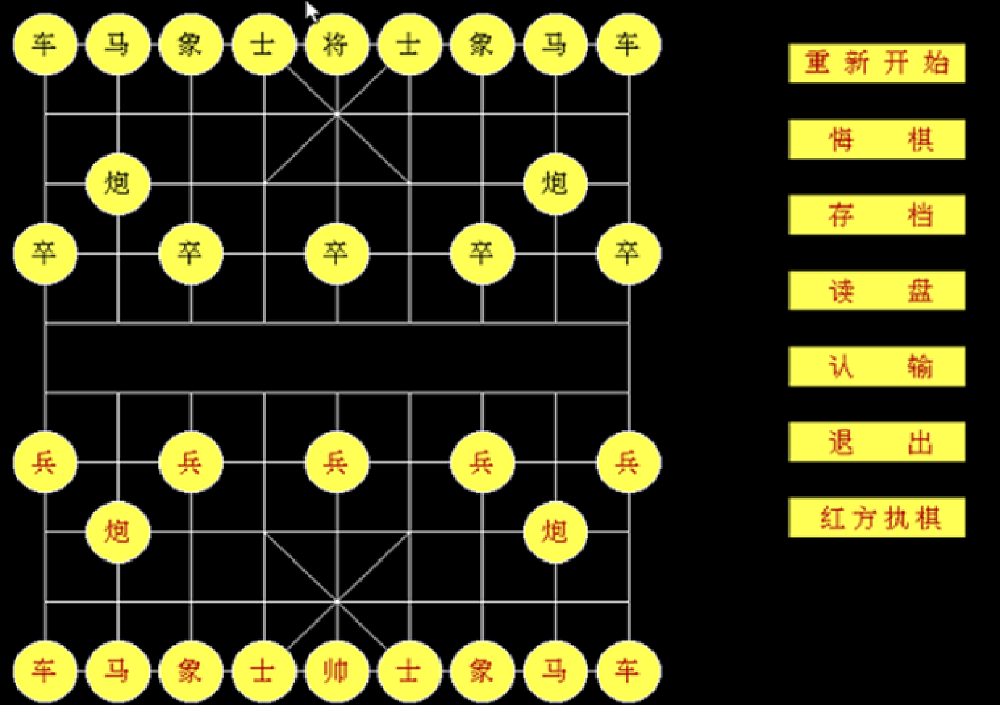

# tc-Chinese-Chess
a Chinese Chess program written in Turbo C and run under dos environment 

Please use a dosbox and TC compiler to compile and link the source codes.

Instruction:
1. Right click on the chess board to restart the game
2. Left click to choose a chess and drag a chess to a legal place.
3. The program will check if the operation is legal and the win or lose of the game.
4. Left click save or load bottom to save or load the .dat file of the game.

finished in 2013. by Lei Zhang